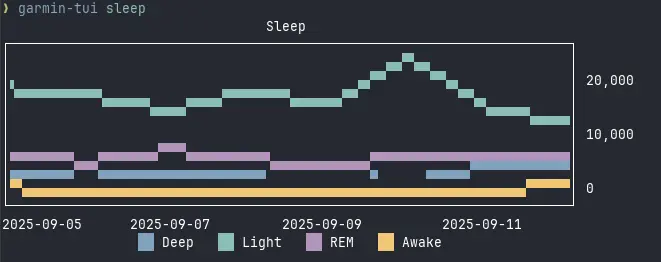
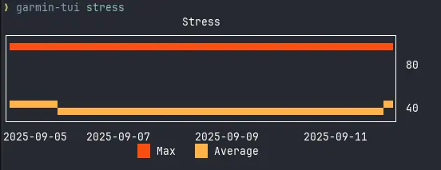

# garmin-tui

I really want this to be a golang app, but python's garmin client library is more robust, so there's that.

I can stand up a python api and have golang tui app talk to it, but then I need to deploy the api, and I'm not going to do that.

Also if you can't tell by now, I'm very lazy, especially if I have to open a browser and visit a website. TUI gang rise up.

## Install

```bash
make install
```


## CLI

```bash
❯ garmin-tui
Usage: garmin-tui [OPTIONS] COMMAND [ARGS]...

Options:
  --version  Show the version and exit.
  --help     Show this message and exit.

Commands:
  bb      Display body battery
  login   Login
  rhr     Display resting heart rate
  sleep   Display sleep
  stress  Display stress
```

## Screenshots





